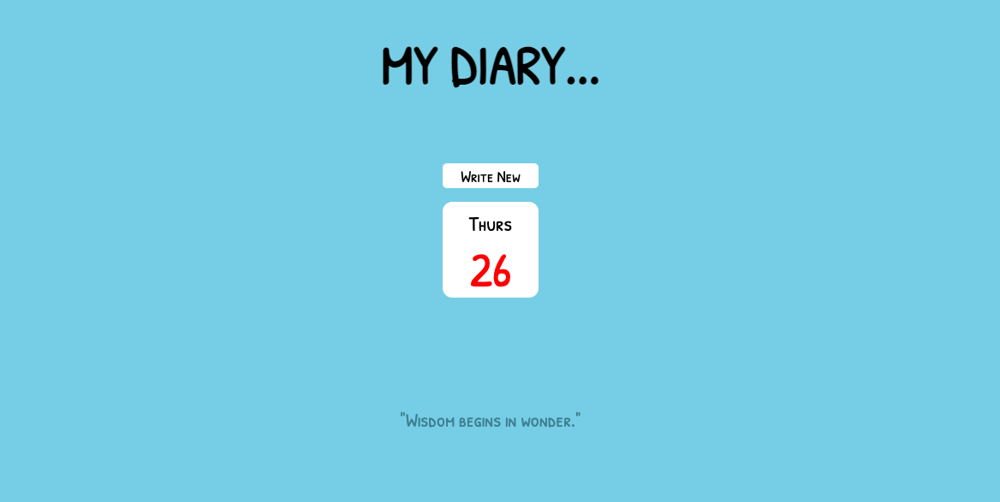
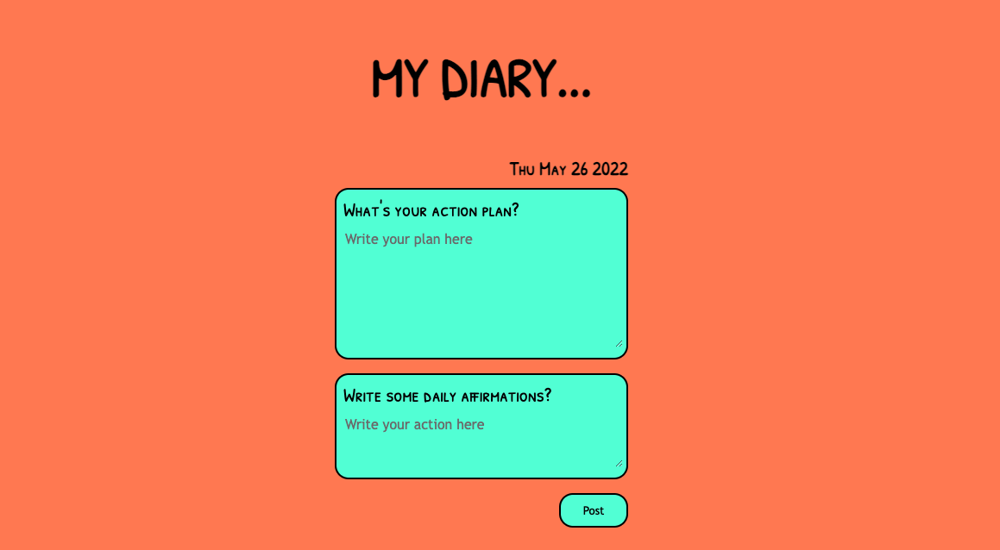
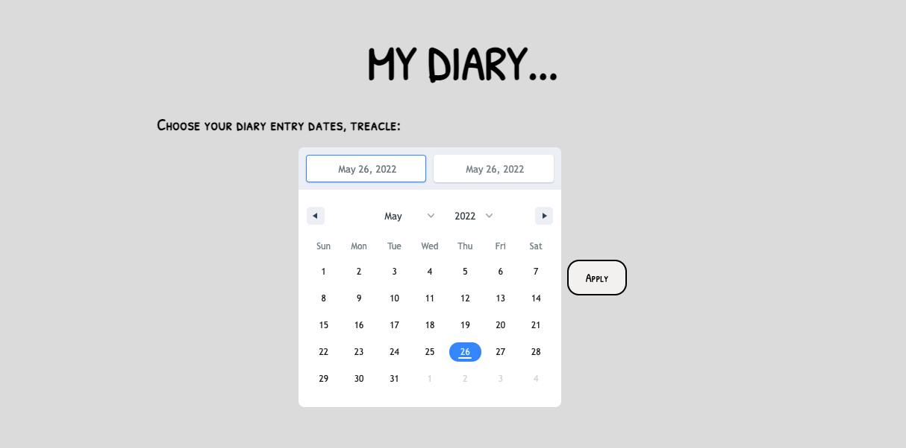
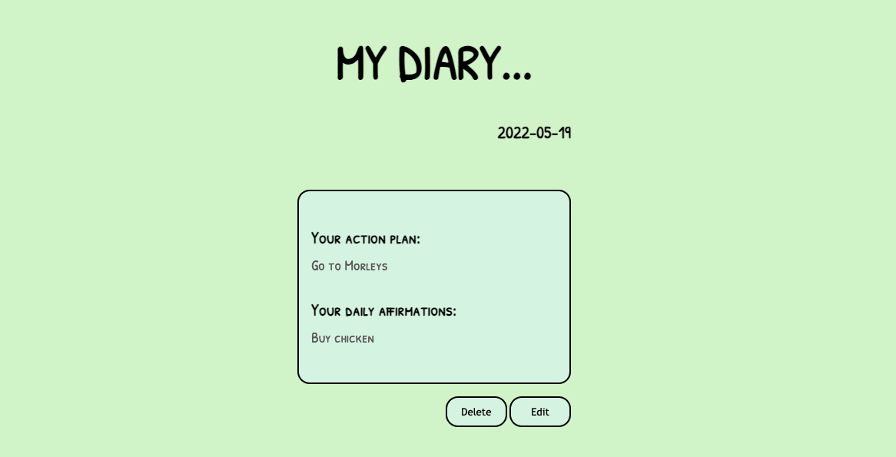
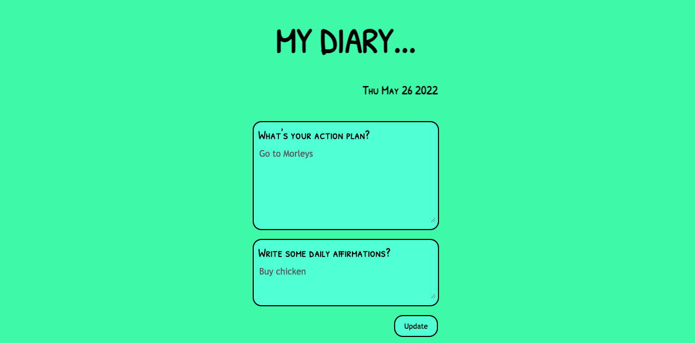

# solo-project-diary-client


# Project Description

Overview:

Welcome to My Dairy. An application made using Javascript, React.js, ExpressJS, nodejs, Prism, PostgreSQL, Postman and HTML & CSS.

When running the liver server of the application on both the client and the server side, you will be relocated to the home page where you can read some positive, yet inspirational quotes to help boost your day. The user can either click onto "Write New" where s/he can write up a diary entry followed by two questions being: "What's your action plan?", and, "Write some daily affirmations?", or you can simply click onto the calendar icon which will relocate you to a page with an interactive calendar. 

Once using the calendar accordingly, a list of diary entries will be presented where you can scorll horizontally to choose your desired diary entry. 

When you have clicked onto your diary entry, you can view it rendered with two options to either "delete" or "edit". Bare in mind, at any time you can click onto the "My Diary" which can then relocate you back to the home page!








# Setup instructions

Clone this repository

```sh
$ git clone git@github.com:BAZBOT123/solo-project-diary-client.git && cd team-dev-client
$ npm ci # install dependencies
$ npm start
# then point your browser to localhost:3000
```

You can refer to the server file (solo-project-diary-server) to view ERD during project development.

Lessons I learnt was that I have already done these algorithms before, but just in another way. Just trust the process. Adding a little hard work, with some research and experimenting with your code will help you in the long run.

The biggest challenges I faced during this project was facing problems with occuring bugs in my code. It helps a lot when you are apply console.logs and looking at the following errors in your terminal and console on the browser.
